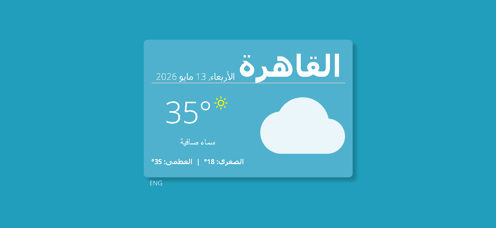

# Weather App 🌤️

A modern, responsive weather application built with **React** and **Vite**. Get real-time weather data for Cairo with a beautiful UI and multilingual support (English & Arabic).

**[View Live Demo](https://omar-abdelraheem.github.io/Weather-App)**

---

## ✨ Features

- 🌡️ **Real-time Weather Data** - Current temperature, min/max conditions from Open Meteo API
- 🎨 **Beautiful UI** - Modern, responsive design built with Material-UI
- 🌍 **Multilingual Support** - Full English and Arabic language support with RTL compatibility
- 📱 **Fully Responsive** - Works seamlessly on desktop, tablet, and mobile devices
- 🎯 **Weather Icons** - Dynamic weather condition icons using React Icons
- 📅 **Date/Time Display** - Current date formatted in your selected language using Day.js
- ⚡ **Fast Performance** - Built with Vite for rapid development and optimized builds
- 🔄 **Language Toggle** - Easy switch between English and Arabic

---

## 📸 Screenshot

---

## 🛠️ Tech Stack

- **React 19** - UI library
- **Vite 8** - Build tool with HMR support
- **Material-UI (MUI 9)** - Component library
- **Axios** - HTTP client for API requests
- **i18next** - Internationalization framework
- **react-i18next** - React binding for i18next
- **Day.js** - Date/time library
- **React Icons** - Weather condition icons
- **Open Meteo API** - Free weather data provider
- **Lottie React** - Animation library
- **ESLint** - Code quality

---

## 📋 Requirements

- Node.js (v14 or higher)
- npm or yarn

---

## 🚀 Getting Started

### 1. Clone the repository

\`\`\`bash
git clone https://github.com/omar-abdelraheem/Weather-App.git
cd weather-app
\`\`\`

### 2. Install dependencies

\`\`\`bash
npm install
\`\`\`

### 3. Start the development server

\`\`\`bash
npm run dev
\`\`\`

The app will be available at \`http://localhost:5173\` (or the port shown in your terminal).

---

## 📦 Available Scripts

| Command | Description |
|---------|-------------|
| \`npm run dev\` | Start development server with HMR |
| \`npm run build\` | Build for production (generates \`dist\` folder) |
| \`npm run preview\` | Preview the production build locally |
| \`npm run lint\` | Run ESLint to check code quality |
| \`npm run deploy\` | Build and deploy to GitHub Pages |

---

## 🌐 Internationalization (i18n)

The app supports English and Arabic with full RTL support. Language files are located in:

\`\`\`
public/locales/
├── en/
│   └── translation.json
└── ar/
    └── translation.json
\`\`\`

To add or modify translations, edit the JSON files in the locales folders.

---

## 📍 Current Location

The app is currently configured to display weather for **Cairo, Egypt** with coordinates:
- Latitude: 30.0626
- Longitude: 31.2497

To change this, modify the API request parameters in [src/App.jsx](src/App.jsx).

---

## 🎯 How It Works

1. **Data Fetching** - On component mount, the app fetches current and daily weather data from Open Meteo API
2. **Weather Mapping** - Weather codes are mapped to human-readable descriptions and icons
3. **Responsive Rendering** - UI adjusts automatically based on screen size using Material-UI's useMediaQuery hook
4. **Language Toggle** - Users can switch between languages, which updates both text and date formatting
5. **Optimization** - Axios request cancellation prevents memory leaks when component unmounts

---

## 🔌 API Integration

This project uses the **Open Meteo API** (free, no API key required):
- Endpoint: \`https://api.open-meteo.com/v1/forecast\`
- Data: Current temperature, weather code, and daily min/max temperatures
- Timezone: Africa/Cairo

---

## 📱 Responsive Design

The app is optimized for all screen sizes:
- Mobile-first approach
- CSS media queries via Material-UI
- Responsive typography with \`clamp()\`
- RTL layout support for Arabic

---

## 🎨 Customization

### Colors
Edit styles in [src/App.css](src/App.css) to customize the app's appearance.

### Fonts
Custom fonts are available in [public/fonts/](public/fonts/) directory.

### Weather Icons
Weather condition icons are dynamically generated based on weather codes. Modify the \`getWeatherIcon()\` function in [src/App.jsx](src/App.jsx) to customize them.

---

## 📝 Code Structure

\`\`\`
src/
├── App.jsx          # Main app component with weather logic
├── App.css          # Styling
├── i18n.js          # i18next configuration
├── main.jsx         # React entry point
├── index.css        # Global styles
└── assets/          # Images and fonts
\`\`\`

---

## 🚀 Deployment

This project is deployed on **GitHub Pages**. To deploy your own version:

1. Update the \`homepage\` URL in [package.json](package.json)
2. Run: \`npm run deploy\`
3. GitHub Pages will automatically serve your app

---

## 📄 License

This project is open source and available under the MIT License.

---

## 🤝 Contributing

Contributions are welcome! Feel free to:
- Report bugs
- Suggest improvements
- Submit pull requests

---

## 📧 Contact

For questions or feedback, feel free to reach out through GitHub issues.

---

**Made with ❤️ by [omar-abdelraheem](https://github.com/omar-abdelraheem)**
